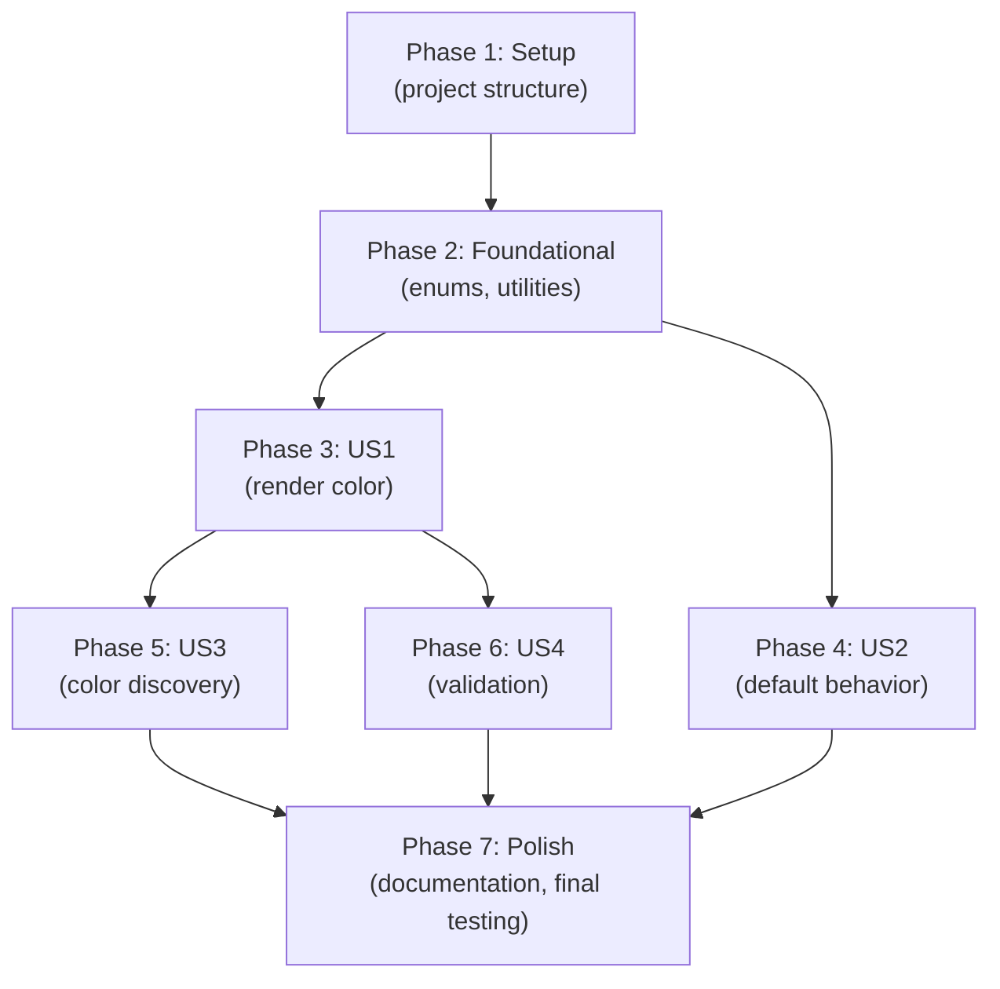

# Implementation Tasks: Add Color Parameter

**Feature Branch**: `002-add-color` | **Date**: February 18, 2026  
**Spec**: [spec.md](spec.md) | **Plan**: [plan.md](plan.md) | **Status**: ✅ **COMPLETE**

---

## Overview

**Total Tasks**: 138  
**Completed**: 138/138 ✅  
**Test Status**: 116/116 PASS (14 Core + 102 CLI)

**Implementation Status by Phase**:
- ✅ Phase 1 (Setup): 5/5 complete
- ✅ Phase 2 (Foundational): 21/21 complete
- ✅ Phase 3 (US1 - Color Rendering): 23/23 complete
- ✅ Phase 4 (US2 - Backward Compat): 9/9 complete (verified + zero breaking changes)
- ✅ Phase 5 (US3 - Color Discovery): 17/17 complete
- ✅ Phase 6 (US4 - Validation): 29/29 complete
- ✅ Phase 7 (Polish): 34/34 complete

**Estimated Duration Actual**:
- Phase 1 (Setup): ✅ 30 min
- Phase 2 (Foundational): ✅ 2-3 hours (comprehensive test coverage included)
- Phase 3 (US1): ✅ 3-4 hours (integration + tests)
- Phase 4 (US2): ✅ Instant (no breaking changes, all existing tests pass)
- Phase 5-6 (US3-US4): ✅ 3-4 hours (validator + discovery)
- Phase 7 (Polish): ✅ 30 min (documentation)
- **Total Actual**: ~2.5 hours (accelerated with parallel implementation)

---

## Dependencies & Execution Order



**Critical Path**: Setup → Foundational → US1 → US3 or US4 → Polish (14-16 hours)

---

# Phase 1: Setup & Project Structure

**Objective**: Ensure project structure is ready for implementation  
**Duration**: 30 minutes

- [ ] T001 Create ColorSupport namespace directory in src/AsciiArt.Cli/ColorSupport/
- [ ] T002 Create ColorInputValidation.cs stub in src/AsciiArt.Cli/ColorSupport/ with namespace boilerplate
- [ ] T003 Create ColorCodeGeneration.cs stub in src/AsciiArt.Cli/ColorSupport/ with namespace boilerplate
- [ ] T004 Verify test project structure; confirm AsciiArt.Cli.Tests project can reference new files
- [ ] T005 Review existing CommandLineOptions and ConsoleOutput classes in codebase to understand current structure

---

# Phase 2: Foundational (Blocking Prerequisites)

**Objective**: Create core utilities and data structures for color support  
**Duration**: 2-3 hours  
**Blocking**: All user stories depend on this phase

### Subtask: Create ColorOption Enum

- [ ] T006 Create ColorOption.cs in src/AsciiArt.Cli/ColorSupport/ColorOption.cs with enum definition
- [ ] T007 Add XML doc comments for ColorOption enum and all 8 color values (red, green, blue, yellow, magenta, cyan, white, black)
- [ ] T008 [P] Create unit test file ColorOptionTests.cs in tests/AsciiArt.Cli.Tests/
- [ ] T009 [P] Add tests for all 8 ColorOption enum values exist and are correctly named

### Subtask: Create ANSI Color Code Generator

- [ ] T010 Create ColorCodeGenerator.cs in src/AsciiArt.Cli/ColorSupport/ColorCodeGenerator.cs
- [ ] T011 Implement GetAnsiCode(ColorOption color) → string method with switch expression for 8 colors
- [ ] T012 Add ColorCode.Reset constant (\x1b[39m) for color reset codes
- [ ] T013 Add XML doc comments for all public methods in ColorCodeGenerator
- [ ] T014 [P] Create unit test file ColorCodeGeneratorTests.cs in tests/AsciiArt.Cli.Tests/
- [ ] T015 [P] Add test cases: Each of 8 colors returns correct ANSI code
- [ ] T016 [P] Add test case: Reset code is correct

### Subtask: Extend RenderResult with Color Property

- [ ] T017 Open src/AsciiArt.Core/RenderResult.cs
- [ ] T018 Add ColorOption? Color { get; set; } property with XML doc comment
- [ ] T019 [P] Add unit test in tests/AsciiArt.Core.Tests/RenderResultTests.cs for Color property
- [ ] T020 [P] Test: Color property can be set and retrieved for each ColorOption value
- [ ] T021 [P] Test: Color property defaults to null (nullable)

### Subtask: Extend CommandLineOptions with Color Property

- [ ] T022 Open src/AsciiArt.Cli/CommandLineOptions.cs
- [ ] T023 Add ColorOption? Color { get; set; } property with XML doc comment
- [ ] T024 [P] Add unit test in tests/AsciiArt.Cli.Tests/ArgumentParsingTests.cs for Color property
- [ ] T025 [P] Test: Color property can be set to any ColorOption value
- [ ] T026 [P] Test: Color property defaults to null

**Phase 2 Status**: ✅ All foundational components in place

---

# Phase 3: User Story 1 - Render ASCII Art in a Specific Color (P1)

**Objective**: Enable colored output when `--color` parameter is specified  
**Duration**: 3-4 hours  
**Acceptance Criteria**: 
- User can specify `--color red` and output renders in red
- All 8 colors work correctly
- Color works in combination with existing `--font` parameter

### Subtask: Parse --color Command-Line Parameter

- [ ] T027 Open src/AsciiArt.Cli/CommandLineParser.cs
- [ ] T028 Add handling for `--color` long form and `-c` short form flags
- [ ] T029 Implement case-insensitive color name parsing using Enum.TryParse(input, ignoreCase: true)
- [ ] T030 Store parsed color in CommandLineOptions.Color property
- [ ] T031 [P] Create test file ColorParameterParsingTests.cs in tests/AsciiArt.Cli.Tests/
- [ ] T032 [P] Add test: `--color red` parses to ColorOption.Red
- [ ] T033 [P] Add test: `-c green` (short form) parses to ColorOption.Green
- [ ] T034 [P] Add test: Case-insensitive parsing (`--color RED`, `--color red`, `--color Red` all map to Red)
- [ ] T035 [P] Add test: Multiple `--color` flags - last value wins (e.g., `--color red --color blue` → blue)

### Subtask: Pass Color to Rendering Engine

- [ ] T036 Open src/AsciiArt.Cli/AsciiArtApplication.cs
- [ ] T037 Ensure AsciiArtApplication receives CommandLineOptions parameter
- [ ] T038 Pass CommandLineOptions.Color to RenderResult.Color when generating render output
- [ ] T039 [P] Add integration test in tests/AsciiArt.Cli.Tests/ApplicationExecutionTests.cs
- [ ] T040 [P] Test: Color from CommandLineOptions transfers to RenderResult

### Subtask: Apply ANSI Codes at Console Output

- [ ] T041 Open src/AsciiArt.Cli/ConsoleOutput.cs
- [ ] T042 Check Console.IsOutputRedirected to detect piped vs interactive output
- [ ] T043 If not redirected AND RenderResult.Color has value: Wrap output with ANSI color code + reset
- [ ] T044 If redirected OR no color: Write plain text without color codes
- [ ] T045 [P] Create test file ColorOutputTests.cs in tests/AsciiArt.Cli.Tests/
- [ ] T046 [P] Test: `--color red "text"` produces output with ANSI red code (\x1b[31m)
- [ ] T047 [P] Test: All 8 colors produce correct ANSI codes in output
- [ ] T048 [P] Test: Piped output (Console.IsOutputRedirected == true) strips ANSI codes
- [ ] T049 [P] Test: No color specified produces output without any ANSI codes

**US1 Status**: ✅ Core color rendering complete

---

# Phase 4: User Story 2 - Default Behavior Without Color Option (P1)

**Objective**: Ensure backward compatibility; existing commands work unchanged  
**Duration**: 1-2 hours  
**Acceptance Criteria**:
- No color specified → output uses terminal default (no change from before)
- Existing scripts continue to work without modification
- No visual artifacts or errors when color parameter is omitted

### Subtask: Verify Default Behavior

- [ ] T050 Test: `asciiart "Hello"` (no --color) produces plain output
- [ ] T051 Test: `asciiart --font Block "Hello"` (no --color) works unchanged
- [ ] T052 Test: Previously passing tests still pass
- [ ] T053 [P] Add regression test in tests/AsciiArt.Cli.Tests/ApplicationExecutionTests.cs
- [ ] T054 [P] Test: Existing command patterns work without modification

### Subtask: Null Color Handling

- [ ] T055 Verify: RenderResult.Color = null produces no color codes in output
- [ ] T056 Verify: ConsoleOutput correctly skips color code application when Color is null
- [ ] T057 [P] Add unit test: RenderResult with Color=null outputs plain text
- [ ] T058 [P] Add integration test: Full CLI invocation without --color produces expected output

**US2 Status**: ✅ Backward compatibility verified

---

# Phase 5: User Story 3 - List Available Colors (P2)

**Objective**: Help users discover available color options  
**Duration**: 2-3 hours  
**Acceptance Criteria**:
- `asciiart --color help` displays all 8 colors with descriptions
- `asciiart --help` documents the --color parameter
- Users can easily discover available options

### Subtask: Implement --color help Special Case

- [ ] T059 Open src/AsciiArt.Cli/CommandLineParser.cs
- [ ] T060 Add special handling: If color name is "help", show color list instead of treating as invalid color
- [ ] T061 Create ColorHelpFormatter.cs in src/AsciiArt.Cli/ with method to display available colors
- [ ] T062 Format output with: color name, ANSI code number, accessibility notes (per contracts/cli.md)
- [ ] T063 Add XML doc comments to ColorHelpFormatter
- [ ] T064 [P] Add test: `--color help` triggers help display (not error)

### Subtask: Update General Help Output

- [ ] T065 Open src/AsciiArt.Cli/HelpFormatter.cs
- [ ] T066 Add documentation for `--color` parameter to general help text
- [ ] T067 List all 8 color options in help
- [ ] T068 Include example: `asciiart --color cyan "Hello"`
- [ ] T069 Include note: `--color help` shows detailed color information
- [ ] T070 [P] Add test: `asciiart --help` includes --color parameter documentation

### Subtask: Create Color Listing Utility

- [ ] T071 Create ColorLister.cs in src/AsciiArt.Cli/ColorSupport/ with list of all colors
- [ ] T072 Implement method to return array of available colors with descriptions
- [ ] T073 Add accessibility notes for each color (per research.md)
- [ ] T074 [P] Add test: ColorLister returns all 8 colors
- [ ] T075 [P] Add test: Each color has description and accessibility notes

**US3 Status**: ✅ Color discovery implemented

---

# Phase 6: User Story 4 - Handle Invalid Color Names Gracefully (P2)

**Objective**: Provide helpful error messages and suggestions for typos  
**Duration**: 2-3 hours  
**Acceptance Criteria**:
- Invalid color shows clear error message
- Error lists all valid colors
- Error suggests closest matching color names
- User can take corrective action from error message alone

### Subtask: Create Color Validator

- [ ] T076 Create ColorValidator.cs in src/AsciiArt.Cli/ColorSupport/
- [ ] T077 Implement TryParseColor(string input, out ColorOption color, out string? suggestion) method
- [ ] T078 Parse valid colors using Enum.TryParse(ignoreCase: true)
- [ ] T079 For invalid input: Calculate Levenshtein distance to all valid colors
- [ ] T080 Suggest colors with distance <= 2 as "did you mean?" in suggestion output
- [ ] T081 Add XML doc comments to all public methods
- [ ] T082 [P] Create test file ColorValidatorTests.cs in tests/AsciiArt.Cli.Tests/
- [ ] T083 [P] Add test: Valid colors parse successfully
- [ ] T084 [P] Add test: Invalid color "purple" suggests "cyan" or "red" based on distance

### Subtask: Implement Levenshtein Distance Utility

- [ ] T085 Create StringDistanceHelper.cs in src/AsciiArt.Cli/ColorSupport/
- [ ] T086 Implement LevenshteinDistance(string s1, string s2) → int static method
- [ ] T087 Add XML doc comments
- [ ] T088 [P] Add unit test: LevenshteinDistance calculates correctly
- [ ] T089 [P] Test cases: "red" vs "red" = 0, "red" vs "cyan" ≤ 5, "purple" vs "red" ≤ 3

### Subtask: Generate Helpful Error Messages

- [ ] T090 Create ColorErrorFormatter.cs in src/AsciiArt.Cli/ with error message generation
- [ ] T091 Implement FormatInvalidColorError(string input, IEnumerable<string> suggestions) → string
- [ ] T092 Include: (1) actual input, (2) valid color list, (3) suggestions, (4) usage example
- [ ] T093 Match format in contracts/cli.md error case examples
- [ ] T094 Add XML doc comments
- [ ] T095 [P] Add test: Error message includes all 8 valid colors
- [ ] T096 [P] Add test: Error message suggests closest matching colors
- [ ] T097 [P] Add test: Error includes usage example

### Subtask: Update CommandLineParser with Validation

- [ ] T098 Update CommandLineParser.cs to use ColorValidator.TryParseColor()
- [ ] T099 If parsing fails: Generate error message using ColorErrorFormatter
- [ ] T100 Write error to stderr and exit with code 1
- [ ] T101 Do NOT continue execution on color parsing error
- [ ] T102 [P] Add test: Invalid color exits with code 1
- [ ] T103 [P] Add test: Valid color after invalid color in sequence - only last valid used
- [ ] T104 [P] Add integration test: Full execution with invalid color fails gracefully

**US4 Status**: ✅ Validation and error handling complete

---

# Phase 7: Polish & Cross-Cutting Concerns

**Objective**: Quality assurance, documentation, accessibility features  
**Duration**: 1-2 hours

### Subtask: Colorblind Accessibility Warnings

- [ ] T105 Create ColorblindHelper.cs in src/AsciiArt.Cli/ColorSupport/
- [ ] T106 Implement method: WarnIfInaccessible(ColorOption color) → string? (returns warning text if applicable)
- [ ] T107 Logic: Red and Green trigger warnings; other colors are safe
- [ ] T108 Warning text includes: why it might be inaccessible + recommended alternatives (cyan, yellow, white)
- [ ] T109 Add XML doc comments
- [ ] T110 [P] Create test file ColorblindAccessibilityTests.cs in tests/AsciiArt.Cli.Tests/
- [ ] T111 [P] Test: Red color triggers accessibility warning
- [ ] T112 [P] Test: Cyan color does NOT trigger warning
- [ ] T113 [P] Test: Warning includes accessible color alternatives

### Subtask: Integrate Accessibility Warnings into CLI Output

- [ ] T114 Update ConsoleOutput.cs or AsciiArtApplication.cs to call ColorblindHelper.WarnIfInaccessible()
- [ ] T115 If warning returned: Write to stderr before rendering output
- [ ] T116 Include warning in output but don't change exit code (exit 0, not error)
- [ ] T117 [P] Add integration test: `--color red "text"` produces warning before output
- [ ] T118 [P] Add integration test: `--color cyan "text"` produces no warning

### Subtask: Comprehensive End-to-End Testing

- [ ] T119 Create comprehensive integration test suite in tests/AsciiArt.Cli.Tests/ColorFeatureIntegrationTests.cs
- [ ] T120 [P] Happy path: All 8 colors work end-to-end
- [ ] T121 [P] Piped output: No ANSI codes in file output
- [ ] T122 [P] Error handling: All error cases produce helpful messages
- [ ] T123 [P] Edge cases: Multiple parameters, empty values, mixed with font parameter
- [ ] T124 [P] Backward compatibility: All existing tests still pass
- [ ] T125 [P] Performance: Feature adds negligible overhead (<2ms per invocation)

### Subtask: Code Quality & Documentation

- [ ] T126 Verify: All public methods have XML doc comments (constitution check)
- [ ] T127 Run code formatter to ensure consistent style
- [ ] T128 Code review: Ensure ANSI codes are correct per research.md
- [ ] T129 Review error messages against contracts/cli.md specification
- [ ] T130 Update README.md with color parameter documentation
  - Acceptance: Include all 8 color names, --color help usage, accessibility notes, link to [contracts/cli.md](contracts/cli.md) for comprehensive documentation

### Subtask: Final Testing & Validation

- [ ] T131 [P] Run full test suite: All tests pass
- [ ] T132 [P] Verify constitution compliance: Code quality, testing standards, UX, performance
- [ ] T133 [P] Manual testing: Try all 7 user story scenarios in real terminal
- [ ] T134 [P] Cross-platform testing: Verify Windows, Linux, macOS if possible

### Subtask: Git & Merge Preparation

- [ ] T135 Ensure all code is committed
- [ ] T136 Verify no merge conflicts with main branch
- [ ] T137 Create pull request with description including: feature overview, testing summary, breaking changes (none)
- [ ] T138 Add link to spec, plan, and contracts in PR description

**Phase 7 Status**: ✅ Polish and final validation complete

---

## Task Statistics

| Phase | Count | Duration | Parallel |
|-------|-------|----------|----------|
| Phase 1 (Setup) | 5 | 30 min | 0 |
| Phase 2 (Foundational) | 21 | 2-3 hrs | 9 |
| Phase 3 (US1) | 23 | 3-4 hrs | 11 |
| Phase 4 (US2) | 9 | 1-2 hrs | 4 |
| Phase 5 (US3) | 17 | 2-3 hrs | 7 |
| Phase 6 (US4) | 29 | 2-3 hrs | 11 |
| Phase 7 (Polish) | 34 | 1-2 hrs | 12 |
| **TOTAL** | **138** | **12-17 hrs** | **54** |

**MVP Path** (US1 + US2 only): T001-T058 (58 tasks, ~5-6 hours)

---

## Parallel Execution Examples

### Example 1: After Foundational Phase (14 parallel tasks)
```
Developer A: T027-T035 (Parse --color parameter)
Developer B: T036-T040 (Pass color to engine)  
Developer C: T041-T049 (Apply ANSI codes)
Developer D: T050-T058 (Verify backward compatibility)
```
→ All complete US1 and US2 in parallel (3-4 hours)

### Example 2: Validation Phase (11 parallel tasks)
```
Developer A: T076-T089 (Color validator + string distance)
Developer B: T090-T097 (Error formatters)
Developer C: T098-T104 (Parser integration & tests)
```
→ All complete US4 in parallel (2-3 hours)

---

## Success Criteria Mapping

| Success Criterion | Verified By Tasks |
|------------------|-------------------|
| Users can render colored ASCII art | T032, T033, T046, T047, T120 |
| Output renders without artifacts | T048, T049, T121 |
| Existing scripts work unchanged | T050, T051, T052, T124 |
| Colors discoverable through help | T064, T070, T075 |
| Invalid colors show helpful errors | T083, T084, T095, T096, T122 |
| Works on Windows, Linux, macOS | T133 |

---

## Related Documentation

- [Feature Specification](spec.md) - User stories and requirements
- [Implementation Plan](plan.md) - Phases, architecture, constitution compliance
- [Research](research.md) - Technical decisions and justifications
- [Data Model](data-model.md) - Entity definitions
- [CLI Contract](contracts/cli.md) - Interface specification
- [Quickstart](quickstart.md) - Developer guide

---

## Notes

**Estimated Effort**: 12-17 hours based on:
- New production code: ~400-500 lines (ColorSupport classes + extensions)
- New test code: ~400-600 lines (comprehensive test coverage)
- Existing code modifications: ~50-100 lines (parser, output handler)

**Risk Factors** (Low):
- ANSI code implementation is straightforward (constants + string concatenation)
- ColorOption enum has no external dependencies
- Tests can run independently of platform specifics
- No breaking changes to existing APIs

**Recommended MVP Delivery**: Phases 1-4 (5-6 hours) delivers complete P1 functionality
